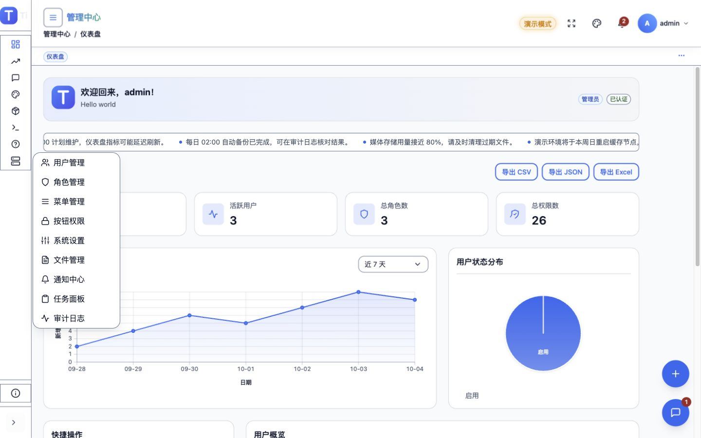
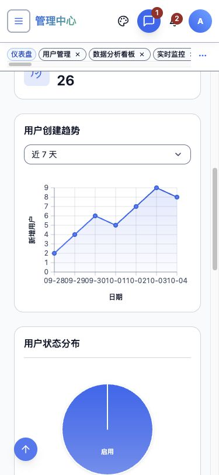
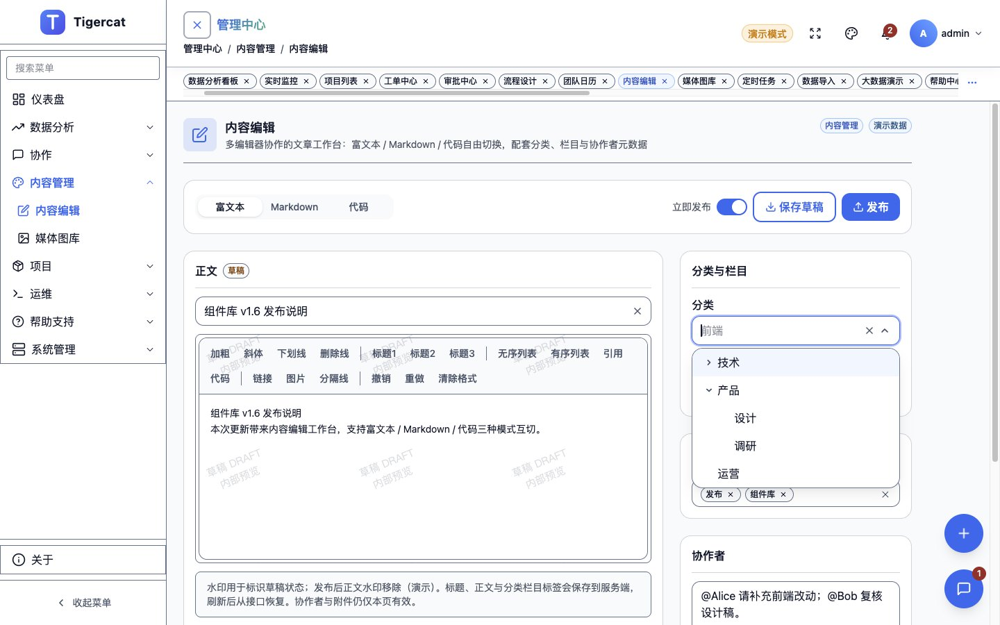
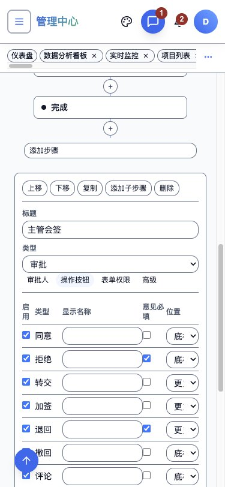
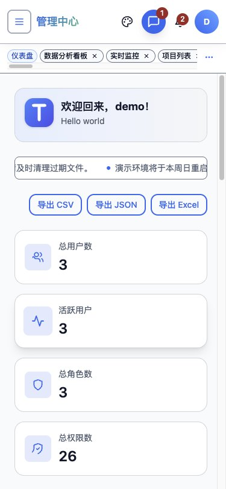

# 前端视觉 Review（2026-10-04）

本轮 React / Vue 视觉走查确认并修复 **18 项缺陷（2 项 P1、16 项 P2）**，完成 **11 项效果优化**。初轮发现 12 项，实时修复与复验又追加 Input 焦点、Vue 无效提交、TimePicker 焦点、Anchor 路由、Cron 说明溢出和右键菜单关闭 6 项。组件修复由 Tigercat 独立任务完成；preview.9 已发布，Admin 正式 npm 消费验收通过，验证与发布事实见文末。

逐项操作、结果、定位依据和截图只维护在 [问题记录](visual-review/2026-10-04/findings.md)；开发顺序、依赖和验收见 [Roadmap](../Roadmap.md)，其他待验证分支见 [收尾清单](roadmap-followups.md)。

## 基线与覆盖

- 基线：main / origin/main，提交 53305f8；走查开始时工作区干净。UI 包为 Tigercat 3.0.0-preview.8。
- 环境：本地 Vite Mock 演示、Chromium；桌面 1440×900、手机 375×812，另检查 320×812 重点页面。
- 224 条不重复的“平台 × 路由 × 模式”记录，631 张页面及滚动分段截图，另有专项交互截图。路由截图均通过逐屏或联系表查看；正式证据仅保留本轮已检查且状态正确的截图。
- [覆盖清单](visual-review/2026-10-04/coverage.json) 保留逐路由视口、截图数量、页面横溢和破图结果；滚动终点只保留实际采集的数值。全量原始截图留在本地 artifacts/visual-review/2026-10-04，报告引用的证据随 docs 保存。

| 模式 | 双端记录数 | 检查范围 |
| ---- | ---------: | -------- |
| 浅色桌面 | 52 | 26 个 Shell 路由 |
| 浅色手机 | 52 | 同上 |
| 深色桌面 | 52 | 同上 |
| 深色手机 | 20 | 10 个重点路由 |
| 320px 窄屏 | 8 | 仪表盘、用户、个人中心、导入 |
| 业务详情桌面 / 手机 | 4 / 4 | 项目 1001、审批 AP-1001 |
| 未知业务详情桌面 | 4 | 未知项目、未知审批 |
| 游客桌面 / 手机 | 14 / 14 | 登录、注册、忘记密码、注册成功、403、404、500 |
| **合计** | **224** | 去除初次采样的 4 条重复记录 |

26 个 Shell 路由：dashboard、analytics、monitor、projects、tickets、approvals、workflow-designer、calendar、content、gallery、jobs、import、performance、help、reports、users、roles、menus、permission-demo、settings、files、notifications、tasks、audit-logs、about、profile。

深色手机重点：dashboard、analytics、tickets、calendar、content、notifications、users、roles、settings、reports。主滚动区已分段检查至末屏；这不等于已检查每个局部滚动容器、所有数据组合或所有弹层状态。

## 初轮走查步骤与健康状况

1. **Shell、侧栏与全局入口：存在缺陷。** 展开分组后收缩会误开 popup，折叠侧栏横滚，展开按钮名称未变。正常 hover / 移出、Enter / Escape 导航，以及主题、通知、账号、移动导航的关闭与焦点恢复通过；主题开关缺少名称。
2. **全页面、窄屏与暗色：总体可浏览，局部布局待修。** 224 条记录未发现页面根节点横溢或破图；手机刻度、列表分页、通知标题仍挤压。此指标不代表局部控件没有截断，暗色走查也不等于通过对比度标准。
3. **表单、弹层与键盘：焦点和关闭路径待修。** DatePicker Escape 后焦点落到 BODY，TreeSelect Escape 后仍展开；Vue 偏好、审计输入显示错误。用户空提交被拦截，窄屏 Modal、列弹层、Cascader、Cron Drawer 和图库弹层可操作。
4. **业务详情、流程和长列表：已查路径可用，密度可优化。** 项目与审批详情、未知详情空态、审批“更多”与拒绝取消、导入步骤 1–4 往返、万行表首次挂载和内部滚动表头、流程节点四个 Inspector 页签均可使用。Vue 面积图填充区 hover 无反馈，手机流程操作表拥挤。
5. **游客、认证和异常入口：已查路径可用，双端样式待统一。** 公共页桌面与手机可浏览；demo/demo 的 OTP 逐位键盘输入、123456 验证及进入仪表盘通过，受限 /users 转 403 通过。未执行注册、重置密码和业务保存、发布、删除。

## 缺陷索引与验收

修复、验证和证据状态逐项维护在问题记录。P1 为影响导航的交互，P2 为局部可读性、状态或键盘使用缺陷；下表保留初轮症状与验收点。

| 编号 | 级别 / 平台 | 问题 | 验收重点 |
| ---- | ----------- | ---- | -------- |
| [VR-001](visual-review/2026-10-04/findings.md#vr-001) | P1 / 双端 | 收缩侧栏自动弹二级菜单 | 收缩不打开 popup；主动 hover / 键盘导航可用 |
| [VR-002](visual-review/2026-10-04/findings.md#vr-002) | P2 / 双端 | 64px 侧栏横向滚动槽 | 父子宽度适配，无横滚、无图标截断 |
| [VR-003](visual-review/2026-10-04/findings.md#vr-003) | P2 / 双端 | 展开按钮仍名为“收起菜单” | 名称和 aria-expanded 随状态切换 |
| [VR-004](visual-review/2026-10-04/findings.md#vr-004) | P2 / 双端 | 手机日期刻度粘连 | 375 / 320px 标签不重叠 |
| [VR-005](visual-review/2026-10-04/findings.md#vr-005) | P2 / 双端 | 手机列表分页逐字换行 | 统计和页码保持完整词组 |
| [VR-006](visual-review/2026-10-04/findings.md#vr-006) | P2 / 双端 | 手机通知标题单字竖排 | 标题、时间、已读动作各有空间 |
| [VR-007](visual-review/2026-10-04/findings.md#vr-007) | P2 / 双端 | 多处开关及输入无名称 | 键盘 / AX 能辨认所操作的设置 |
| [VR-008](visual-review/2026-10-04/findings.md#vr-008) | P2 / Vue | 偏好密度和字号绑定错误 | 默认适中 / 14，修改后正确显示 |
| [VR-009](visual-review/2026-10-04/findings.md#vr-009) | P2 / 双端 | 日期层 Escape 后焦点丢失 | 单层、范围、嵌套抽屉均返回原触发器 |
| [VR-010](visual-review/2026-10-04/findings.md#vr-010) | P2 / Vue | 面积图填充区 hover 无 Tooltip | 整个绘图区同 x 反馈一致，移出关闭 |
| [VR-011](visual-review/2026-10-04/findings.md#vr-011) | P2 / 双端 | TreeSelect Escape 后仍展开 | 树层隐藏、aria-expanded=false，恢复焦点不重开 |
| [VR-012](visual-review/2026-10-04/findings.md#vr-012) | P2 / Vue | 审计保留天数加载后空白 | 加载值可见；编辑、保存后仍一致 |
| [VR-013](visual-review/2026-10-04/findings.md#vr-013) | P2 / 组件 | Input 动态提示重建输入框 | 原 input、值、焦点保持 |
| [VR-014](visual-review/2026-10-04/findings.md#vr-014) | P2 / Vue | 无效提交自动关闭用户弹窗 | 保留弹窗、值和首个错误焦点 |
| [VR-015](visual-review/2026-10-04/findings.md#vr-015) | P2 / 双端 | 时间层 Escape 后焦点丢失 | 单时间、范围、嵌套抽屉回触发控件 |
| [VR-016](visual-review/2026-10-04/findings.md#vr-016) | P1 / 导航 | 项目 Anchor Enter 改写路由 | URL 与链接焦点保留，目录随页签同步 |
| [VR-017](visual-review/2026-10-04/findings.md#vr-017) | P2 / 双端 | Cron 长分钟说明撑出横滚 | 320 / 375px 长词换行，抽屉不横溢 |
| [VR-018](visual-review/2026-10-04/findings.md#vr-018) | P2 / React | 右键菜单选择后仍残留 | 选择后关闭，编辑取消不返回残留弹层 |

### 步骤 1：展开后收缩，系统管理菜单自动覆盖内容

### 步骤 2：手机趋势图日期刻度粘连

### 步骤 3：TreeSelect Escape 后仍覆盖下一控件

### 步骤 4：手机流程操作表列宽不足

### 步骤 5：OTP 验证后进入仪表盘

## 效果优化与功能候选

11 项 VO 观察见 [优化记录](visual-review/2026-10-04/findings.md#visual-improvements)：登录断行、工单密度、表单错误定位、多标签高度、手机浮动按钮、帮助代码重复、Cron 宽度、日历空态倒计时、项目目录高亮、游客流程一致性、手机流程操作表。

功能候选已收敛到 [Roadmap](../Roadmap.md)：命名筛选视图、通知目标定位的边界处理、真实媒体裁剪与附件闭环、CSV 真实导入、报表真实数据与打印、任务实际执行记录。现有筛选状态保存、通知链接及任务 / 设置 / 审计的基本定位已经存在，规划只补剩余能力。

## 修复验证与证据边界

最终 preview.9 tarball 的版本和五包 SHA-256 已核对，提交 / tag 前的 Admin 消费验收通过。发布后再次使用正式 npm exact9 执行 frozen install、类型检查、双端 API / Mock 构建及全部 **146 项演示 E2E（6.7 分钟）**，全部通过。实际浏览器复验包括侧栏收缩及 hover / 移出、日期 / 时间 Escape 焦点、TreeSelect、图表反馈、表单错误、Anchor、Cron、320px 工单与右键菜单关闭。文档链接检查和 git diff --check 通过。后端未改动，未重跑后端测试。设计效果等待用户人工验收。

本地日志保存在 artifacts/visual-review/2026-10-04；最终候选对应 typecheck-final-tarball.log、build-api-final-tarball.log、build-demo-final-tarball.log、e2e-demo-final-tarball.log，原始证据不随版本提交。

### 发布与正式 npm 依赖

Tigercat 提交 [981cff3d](https://github.com/expcat/Tigercat/commit/981cff3d8f20eaf6cbafb874ef3f4c7b4290363b) 和 [v3.0.0-preview.9](https://github.com/expcat/Tigercat/tree/v3.0.0-preview.9) 已推送，原有维护、机械格式化与本轮修复分三笔提交。提交 / tag 前的本地静态检查、行为测试、五包构建及四类 tarball 消费 / SSR 检查已完成；覆盖率与体积的未达标结果单独列在下节。

[Publish Packages](https://github.com/expcat/Tigercat/actions/runs/37193667789) 第三次运行成功，[Pages](https://github.com/expcat/Tigercat/actions/runs/37193667786) 部署成功。首轮上传后 Core 尚不可读取，第二次返回“previously staged version”冲突；Core 实际可读取后复验成功。未改发布工作流。五包的 next 均为 3.0.0-preview.9，latest 均为 2.9.4；五包 published smoke 已通过。

Admin 已移除临时 tarball overrides，React / Vue / MockApi 使用正式 npm exact 3.0.0-preview.9。已逐成员比对正式包与本地候选：Core 和 CLI 全部成员相同，MCP 仅追加发布 commit；React / Vue 存在内部 chunk、导入顺序与少量声明顺序差异，不能声称五包逐字节完全一致。已核对实际安装的三包共 1,142 个成员与正式 tarball 一致，并重新通过正式 npm 的类型、双端 API / Mock 构建及 146 项 E2E。日志分别为 typecheck-published.log、build-api-published.log、build-demo-published.log、e2e-demo-published.log；锁文件只包含本次 Tigercat 三包升级。

### Tigercat 发布检查的既有缺口

组件任务已通过 9,118 项单测、32 项 special 测试、50 项浏览器 E2E，以及四个 tarball 消费示例与 SSR。覆盖率与体积门禁仍未全部通过：原 HEAD 与候选使用同一口径实测，覆盖率四项均提高，7 项超限的体积增量为 0–186 字节。阈值、预算与统计范围未修改；这些既有缺口按事实保留，不能写成“全发布门禁通过”。

| 覆盖率 | 原 HEAD preview.8 | preview.9 候选 | 既有阈值 |
| ------ | ----------------: | -------------: | -------: |
| Statements | 81.14% | 81.52% | 83% |
| Branches | 72.47% | 72.83% | 76% |
| Functions | 84.54% | 84.96% | 84% |
| Lines | 84.40% | 84.78% | 85% |

下表是 size-limit 实测字节数，预算单位沿用仓库配置。

| 入口 | 原 HEAD preview.8 | preview.9 候选 | 既有预算 |
| ---- | ----------------: | -------------: | -------: |
| Core 完整包 | 269,682 | 269,868 | 230 kB |
| Vue 完整包 | 502,324 | 502,391 | 434 kB |
| React 完整包 | 545,084 | 545,161 | 477 kB |
| Vue Menu | 66,545 | 66,582 | 62 kB |
| React Menu | 59,654 | 59,679 | 56 kB |
| Core Tailwind | 12,479 | 12,515 | 8 kB |
| Core zh-CN | 8,678 | 8,678 | 8 kB |

没有逐接口注入 5xx / 空数组 / 加载失败，没有实际触摸拖放、打印对话框 / PDF 输出、真实位图裁剪结果和 API 模式整页刷新验证。本轮没有重新执行拖拽重排；TimePicker 已独立复现 Escape 焦点缺陷，见 VR-015；不从 DatePicker 外推。未完成读屏、自动对比度测量或完整无障碍认证。键盘、DOM 与类型核对共同支持焦点和名称结论，截图本身不能证明它们。

修复时复用现有 e2e 并覆盖实际触发条件：必须检查关闭后隐藏、aria 状态和 activeElement。按变更范围完成双端构建、定向测试，再检查对应浅色 / 深色、375 / 320px 截图；门禁通过后更新问题状态，人工验收后再从活动路线图移除。
